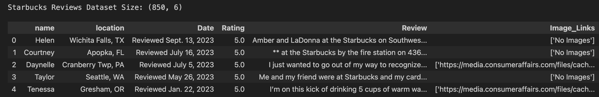
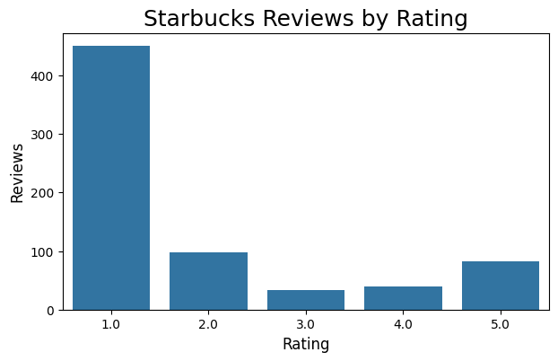

# Topic Modeling: Latent Dirichlet Allocation vs. BERTopic

Topic modeling is a Natural Language Processing (NLP) technique for discovering topics in a collection of documents, allowing you to see hidden structure in your text data. **Latent Dirichlet Allocation** (LDA), which was first presented in 2003 by David Blei, Andrew Ng and Michael I. Jordan, long reigned as the premier topic modeling method. However, **BERTopic** by Maarten Grootendorst burst on the scene in 2022, leveraging recent advancements in large language models. In this sample project, we will focus less on the mathematics behind these methods and more on practical differences between LDA and BERTopic and the basics of how to make topic models.


## LDA vs. BERTopic Overview

| **LDA** | **BERTopic** |
| ----------------------------------------------- | ----------------------------------------------- |
| Bayesian probabilistic model that estimates probability distributions for topics in documents and words in topics. | Algorithm that leverages the transformer-based model BERT and c-TF-IDF to "create dense clusters allowing for easily interpretable topics whilst keeping important words in the topic descriptions." (Grootendorst, 2022) |
| Each document is assigned topic probabilities.<br /> - Document 1 is 80% Topic 3, 15% Topic 2, 5% Topic 5 | Each document is assigned to a single topic.<br /> - Document 1 is Topic 3 |
| While extracted topics can be used to train classification models, topic generation is unsupervised. | Topic generation is unsupervised by default, but semi-supervised and supervised learning approaches are supported. |
| All documents are assigned to at least one topic. | Outlier documents are assigned to Topic -1 (no real topic). |
| No simple mechanism to merge topics. | Overlapping topics can be easily merged. |
| Coherence and perplexity measures readily available for topic evaulation. In practice, these measures may be less effective than using visualizations. | While you can maneuver Gensim (LDA) to calculate coherence and perplexity scores on BERTopic topics, BERTopic does not have these built-in for topic evaluation. However, there are many excellent visualizations available. |

In [Topic Models: Past, Present, Future](https://gradientflow.com/topic-models-past-present-future/), David Blei, co-creator of LDA, discusses how topic modeling allows you to "zoom in and zoom out" on your text data. You can tune your topic model to find a few major themes or many refined categories. In practice, we have found that tuning topic models is more of an art than a science. Visualizations are often much more effective than coherence and perplexity measures at finding the "best" model.

Because the intention of this article is to provide an overview of topic modeling methods, we leave the nuances of fine-tuning models for future articles. Just know that the tuning process is not necessarily straightforward and depends on what you are trying to accomplish.


## Vocabulary

Before creating our models, we review a few key NLP concepts:

- **Tokenization**: In NLP, tokenization is the task of breaking up documents into smaller chunks of text for processing. "Sentence Tokenization" splits documents into sentences, while "Word Tokenization" splits documents into words. There are a myriad of tokenizers available for use. The NLTK library even has a specialized TweetTokenizer designed for the emojis and hashtags found in tweets.

- **Stemming**: Stemming is an NLP technique for transforming words to their root form by chopping off suffixes like "-ing", "-es", and "-ed" (e.g. plays, played, playing -> play).

- **Lemmatization**: Lemmatization is an NLP technique for transforming words to their root form using a dictionary (e.g. is, are, was -> be). Stemming is more performant than lemmitzation, but lemmatization is more accurate.

- **Stop Words**: Stop words are commonly used words in a language (e.g. "a", "an", "the" in English) that occur frequently without contributing much to meaning. Stop words have historically been ignored or removed for many NLP tasks, including search engine queries and in the data preperation step for LDA topic modeling. While LLMs do not require stop word removal prior to generating embeddings, BERTopic still removes stop words when creating topic representations.

- **TF-IDF**: Both LDA and BERTopic topic modeling use a form of TF-IDF (term frequence-inverse document frequence). While we will not delve into the math here, know that TF-IDF measures the importance of a word to a document in a collection of documents. Suppose we have a collection of financial news articles. If we counted up all the words in each article, perhaps we find that one article mentions the word "stock" 10 times and "earnings" 5 times, while another article mentions "stock" 8 times and "tech" 5 times. Even though "stock" is the most frequent term in both articles, it provides less information about comparing the subject of each than "earnings" and "tech."

## Setup

This project requires `Python 3.10` and the [virtualenv](https://pypi.org/project/virtualenv/) library.

Create a Python virtual environment for the project, activate it, and install requirements.

```bash
python3.10 -m venv .venv
source .venv/bin/activate
pip install --upgrade pip
pip install setuptools wheel
pip install -r requirements.txt
python3.10 -m spacy download en_core_web_md
```

## Data

For our topic models, we are using the [Starbucks Reviews Dataset](https://www.kaggle.com/datasets/harshalhonde/starbucks-reviews-dataset/data), curated by Harshal H. Let's start by importing our data into a dataframe and inspecting the first few rows.

```python
import pandas as pd

data = pd.read_csv('starbucks_reviews.csv')
print('Starbucks Reviews Dataset Size:', data.shape)
data.head()
```



There are 850 reviews, and six fields: name, location, date, rating, review, and image links. We only need rating and review for our purposes. 

After checking for review duplications, we discover that `No Review Text` is used for empty reviews. If we remove these, there are 813 reviews remaining.

```python
data.groupby(['Review'])['Review'].agg(['count']).sort_values(by='count', ascending=False)
data = data[ data.Review != 'No Review Text' ].copy()
```

Are our reviews evenly distributed by rating? Let's find out!

```python
import matplotlib.pyplot as plt
import seaborn as sns
%matplotlib inline

plt.figure(figsize=(7,4))
sns.countplot(data=data, x='Rating')
plt.title('Starbucks Reviews by Rating', fontsize=18)
plt.xlabel('Rating', fontsize=12)
plt.ylabel('Reviews', fontsize=12)
plt.show()
```



Interestingly, our reviews are overwhelmingly negative. We will create LDA and BERTopic topic models for reviews with 1 or 2 star ratings to see if we can find out why customers are unsatisfied. Our final dataset has 548 reviews.

```python
df = data[ data.Rating <= 2 ].copy()
```

## Data Preparation

In this section, we will be building out our stop words, as well as tokenizing and lemmatizing our review text. These steps are required for LDA topic modeling. However, for BERTopic, we do not lemmatize our text or remove stop words prior to feeding into the Hugging Face Sentence Transformer model. Stop words are still useful for BERTopic after clustering of our embeddings during the construction of our topic representations, so we will ultimately use the same stop word list for both models, but just at different points in the process.


## Latent Dirichlet Allocation

Install the following libraries For LDA topic modeling: 


## BERTopic

Install the BERTopic model libray:


## Further Reading & Resources

### LDA Topic Modeling
- [Topic Models: Past, Present, Future](https://gradientflow.com/topic-models-past-present-future/)
- [Gensim: Topic Modeling for Humans](https://radimrehurek.com/gensim/)

### BERTopic
- [BERTopic](https://maartengr.github.io/BERTopic/index.html)
- [Advanced Topic Modeling with BERTopic](https://www.pinecone.io/learn/bertopic/)
- [BERTopic Explained](https://www.youtube.com/watch?v=fb7LENb9eag)


## References
- Harshal H. (2023, September). *Starbucks Reviews Dataset* ([Attribution-NonCommercial 4.0 International (CC BY-NC 4.0)](https://creativecommons.org/licenses/by-nc/4.0/)) [Data set]. Kaggle. Retrieved October 22, 2023 from (https://www.kaggle.com/datasets/harshalhonde/starbucks-reviews-dataset/).
- Grootendorst, M. (2022). BERTopic: Neural topic modeling with a class-based TF-IDF procedure. *arXiv:2203.05794*. (https://arxiv.org/abs/2203.05794)
- Rehurek, R. and Sojka, P. (2010, May 22). Software Framework for Topic Modelling with Large Corpora. *Proceedings of LREC 2010 Workshop New Challenges for NLP Frameworks, Valletta, Malta,* 46-50. (https://radimrehurek.com/lrec2010_final.pdf).

